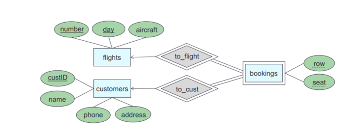

# ER model

Podatkovni model - apstraktni prikaz strukture podataka (ER model, relacijski model)
Shema - opisuje kako su podaci organizirani (tablica s atributima)
Podaci - konkretne instance podataka u bazi

ER model opisuje podatke i odnose među njima
    - entiteti i relacije između njih
    - grafički prikaz - ER dijagram

Entitet - stvarni objekt iz realnog svijeta
    -> svaki entitet ima primarni ključ
Tip entiteta - skup sličnih entiteta
Instanca - aktualno pojavljivanje entiteta
Atribut - svojstvo entiteta
    -> ima domenu koja određuje prihvatljive vrijednosti
    -> podcrtani atribut je ili je dio primarnog ključa
    - može biti: -jednostavni (npr ime)
                 - više vrijednosni - omogućavaju više vrijednosti odjednom (npr osoba ima više telefonskih brojeva)
                 - izvedeni - izračunati iz jednog od atributa (npr godine iz godine rođenja)
                 - kompozitni - sastoje se od više vrijednosti ( npr adresa koja sadrži ulicu, grad, poštanski broj...), može imati niz razina

### Kardinalnost
- minimalna kardinalnost - govori postoji li obavezna veza (0 ili 1)
- totalna participacija - svaki entitet mora biti povezan - dvostruka veza

Jaki entitet - može biti identificiran temeljem njegovih atributa (np primarnim ključem)
Slabi entitet - nema primarnog ključa, potrebna je kombinacija atributa ( diskriminator ) te veze koje ima sa ostalim skupom entiteta(identificirajuća veza)

Relacije - tablice
Entiteti iz ER dijagrama postaju relacije ( tablice ) u relacijskom modelu
Atributi entiteta postaju stupci u tablici
ključni atributi -> primarni ključevi

Veze između entiteta:
- 1:N - vanjski ključ u tablici "N strane"
- M:N - kreira se nova tablica koja sadrži strane ključeve obiju tablica
- 1:1 - dodaje se vanjski ključ u bilo koju od tablica
- više vrijednosni atributi - kreira se nova tablica koja povezuje te atribute sa stranim ključem entiteta

### Relacijski modeli : 

Pretvaranje jakih entiteta
Proizvod(IdProiz, Ime, Opis)
Organizacija(IdOrgz, Naziv)
Kreira(IdProiz, IdOrgz)

Jaki entitet sa kompozitnim atributom
- atribut adresa je kompozitni atribut
Osoba (Id, Ime, adresa_ulica, adresa_grad, adresa_država, adresa_poštanski_broj)

Jaki entitet sa višestrukom vrijednošću
Osoba(Id, Ime)
Osoba_telefon (Id, broj_telefona) 

Slabi entitet
Kredit (ID_broj, Iznos)
Rata (ID_broj, Broj_rate, Datum, Iznos_placanja)

Pretvaranje relacije više-prema-više
Product (Pid, Name, Description)
Company(Cname, Address)
Makes(Pid,Cname, Quantity) - >  veza

Pretvaranje relacije Više-prema-jedan / Jedan-prema-Više
Organizacija (IdOrgz, Naziv)
Proizvod (IdProiz, Ime, Opis)
Kreira (IdProiz, IdOrgz, Količina)

Pretvaranje relacije „Total Participation”
Proizvod (IdProiz, Ime, Opis, IdOrgz, količina)
Organizacija (IdProiz, Naziv)

Pretvaranje relacije „jedan-prema-jedan”
Proizvod (IdProiz, Ime, Opis)
Organizacija (IdOrgz, Naziv, IdProiz, Količina)

Flights (Number, Day, Aircraft)

Customer (CustID, Name, Phone, Address)

Bookings (Number, Day, CustID, Row, Seat)