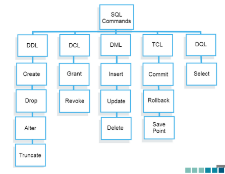

# SQL - SQLite - Data Definition Language

- sql structured query language - strukturirani upitni jezik
- osnovna struktura pohrane je tablica
- upravljanje : selekcija, projekcija, spajanje
- standardizirani jezik stvoren za kreiranje i održavanje relacijskih baza podataka i rad s podacima
- sustavi za upravljanje bazama podataka (DBMS) - Oracle, MS SQL, PostgreSQL, MySQL

U SQL postoji pet kategorija naredbi
a.) Data Definition Language (DDL)
b.) Data Manipulation Language (DML)
c.) Data Control Language (DCL)
d.) Transaction Control Language (TCL)
e.) Data Query Language (DQL)

### SQLite - radno okruženje
- database engine - nije samostalna baza podataka
- instalacija bez  DBMS i administratora
- primjena- web preglednici, operativni sustavi, radna okruženja za web, mobilni telefoni
- slijedi PostgreSQL sintaksu

Osnovni tipovi podataka:
- Numeric
- Integer
- Real
- Text
- Blob

### Sintaksa 

Sintaksa kreiranja tablice
CREATE [TEMP | TEMPORARY] TABLE table-name
(Column-def [, column-def]*
[, constraint]* );

Sintaksa brisanja
DROP TABLE databasename.tablename

Sintaksa stupca
name[type] [[CONSTRAINT name] column-constraint]*

Sintaksa unosa podataka
INSERT INTO table_name(column_name [, ...])
VALUES (new_value [, ...]);

ili

INSERT INTO table_name (col1) VALUES(val1);

Unos višestrukih redova
INSERT INTO table_name [(column-list)]
values(new_value1 [, ...]),
(new_value2 [, ...]),...
(new_valueN [, ...]);

Sintaksa dohvata
SELECT [ALL | DISTINCT] result [FROM table-list]
[WHERE expr]
[GROUP BY expr-list]
[HAVING expr]
[compound-op select]*
[ORDER BY sort-expr-list]
[LIMIT integer [(OFFSET|,) integer]]

### Ograničenja

- postavljanje ograničenja na stupce tablice kako bi zaustavili unos/ažuriranje/brisanje podataka iz stupaca kad se ispuni zahtjev
- definiraju se u procesu generiranja tablice
Vrste ograničenja: 
- Domenski - za validaciju podataka u stupcima tablice
- Integriteta entiteta - osiguravaju da su redovi jednoznačno identificirani
- Referencijalni integritet - održavanje veze između tablica (vanjski ključ)

**NOT NULL** - stupac ne može biti bez nepoznatih podataka

Sintaksa
CREATE TABLE tablename(
    column1 INTEGER,
    column2 TEXT NOT NULL,
    column3 TEXT NOT NULL
);

Error - NOT NULL constraint failed

**DEFAULT** - zadana vrijednost kada nije navedena

Sintaksa
CREATE TABLE tablename
(colum1 INTEGER PRIMARY KEY,
column2 TEXT NOT NULL
column3 INTEGER DEFAULT defaultvalue);

**UNIQUE** - sve vrijednosti u stupcu su različite

CREATE TABLE table_name (
...,
column_name type UNIQUE,
... );

**PRIMARY KEY** - jedinstveno identificira svaki red

Sintaksa - jedan stupac
CREATE TABLE table_name (
...,
column_name type PRIMARY KEY NOT NULL,
... );

Sintaksa - kompozitni primarni ključ
CREATE TABLE table_name (
column_1 type NOT NULL,
column_2 type NOT NULL,
…..
PRIMARY KEY (column_1, column_2)
);

**CHECK** - osiguravaju da vrijednosti u stupcu ispunjavaju postavljene uvjete

