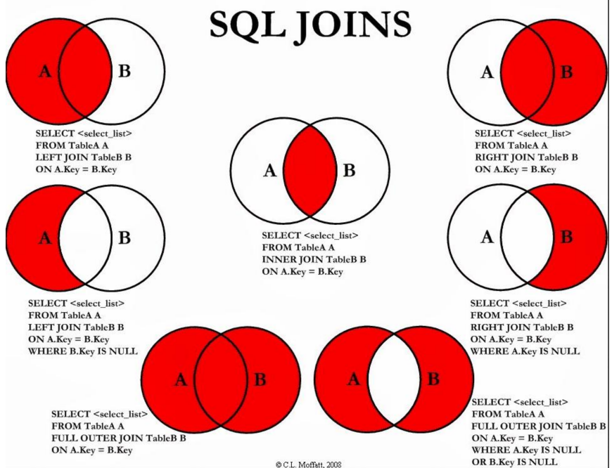

# Data Query Language DQL

**GROUP HAVING** - ključna riječ HAVING se koristi u kombinaciji sa GOURP BY za filtriranje podataka. dohvaćaju se samo podaci koji ispunavaju uvjet

Sintaksa
SELECT column1, column2, ...
FROM table_name
GROUP BY column1, ..
HAVING condition;

**JOIN** - dohvaćanje podataka iz tablica povezanih stranim ključevima

SELECT: definirajte nazive stupaca / atribute
- FROM: definirajte prvu tablicu
- JOIN definirajte tablicu koju povezujte
- = definirajte način povezivanja (PK prve tablice i FK druge tablice)

